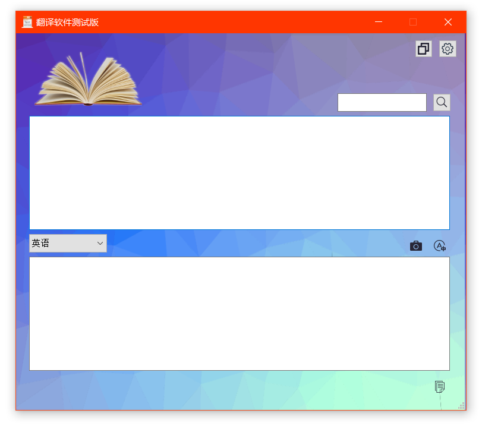
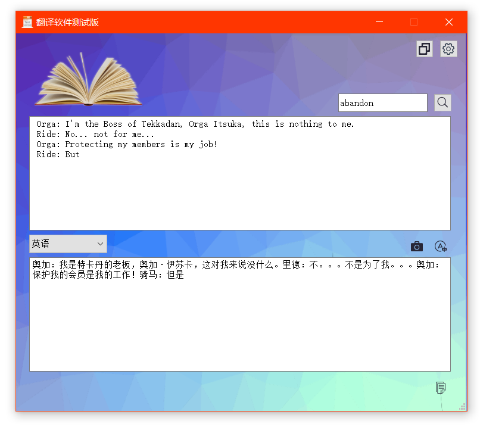
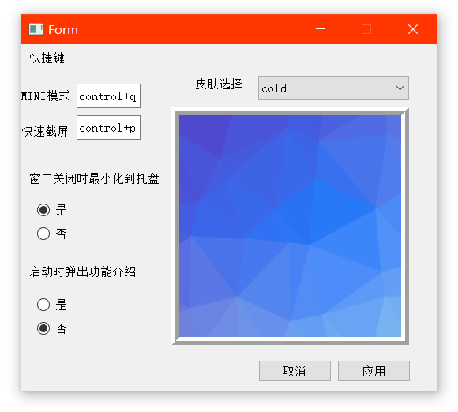
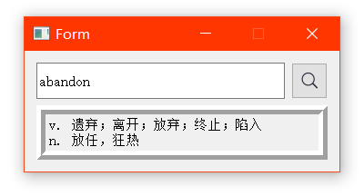
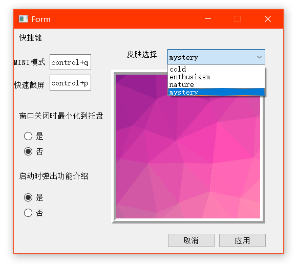

# 项目简介
项目名称: pyshooter2text  
本项目是由李泽凯、汪文涛、杨涛共同开发的截图、ocr(图片转文字)、翻译功能三合一程序，并提供了图形化界面、最小化到托盘、后台快捷键等功能  
___
# 环境配置
## python环境准备
请确保在终端中<b>"python"</b>为运行该项目的解释器  
如果不是，请进行如下修改：  
- 编辑项目文件夹下的 main.py  
将181、225行中的"python"替换为要使用的解释器  
示例："python3" "python3.7" "D:\Venv\myenv\Scripts\python.exe"
- （可选）编辑启动快捷方式  
如果要使用快捷方式启动，请修改项目文件夹下的 Start.sh 、Start.bat  
将其中的"python"替换为要使用的解释器  
## 第三方库
请根据不同系统选择  
- Windows
```sh
/your/interpreter -m pip install -r /path/to/project/requirements-windows.txt
```
- Linux、MacOS同理使用 requirements-linux.txt 、requirements-macos.txt
## macOS请注意
由于xcffib在macos的测试中不能使用，导致system-hotkey，即快捷键功能不能使用。  
__请使用 main.py.bak 替换 main.py__
___
# 启动
## 快捷方式启动
Windows用户请启动项目文件夹下Start.vbs  
Linux/MacOS用户请启动项目文件夹下Start.sh  
## 从终端启动
```sh
cd /path/to/project
/your/interpreter ./main.py
```
___
# 基本操作
主界面如下：  
  
## 截图
  
点击此按钮进入截图，使用鼠标画出需要截下的矩形范围  
截图时可以双击左键或<kbd>Esc</kbd>退出  
示例：红色矩形为截取的范围  
  
## 识别、翻译
  
点击此按钮会对最近一次的截图进行OCR识别和翻译，并且会输出结果  
示例：  
  
使用可以将翻译结果复制到剪贴板  
## 查单词
  
可以快捷查询单词  
示例：  
  
___
# 高级设置
  
进入设置面板  
  
## 全局快捷键
项目默认设置了截图、查单词的全局快捷键  
Ctrl-q    最小化到托盘并弹出快捷查词  
  
Ctrl-p    截图  
这些快捷键可以在setup.ini中进行修改  
## 最小化到托盘
当点击关闭按钮时可选择退出或最小化到托盘  
可以在设置中进行更改  
## 功能介绍
还没有  
## 主题
提供了4种主题可更换  
  
